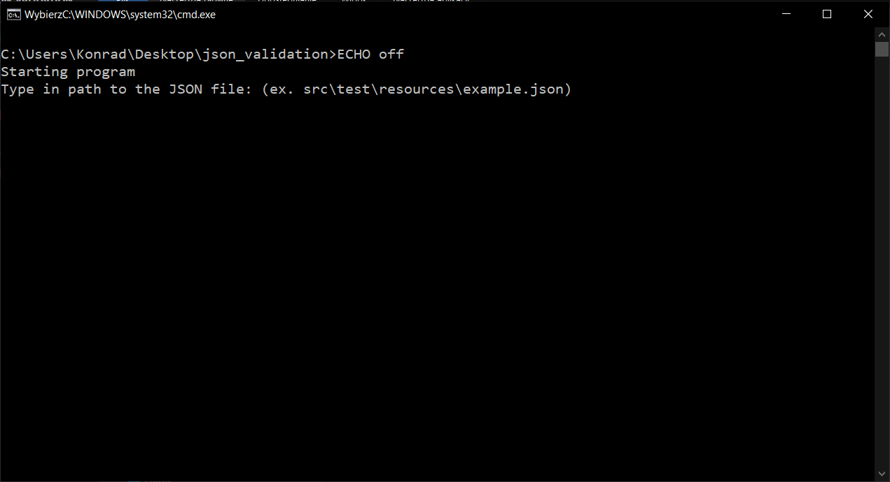
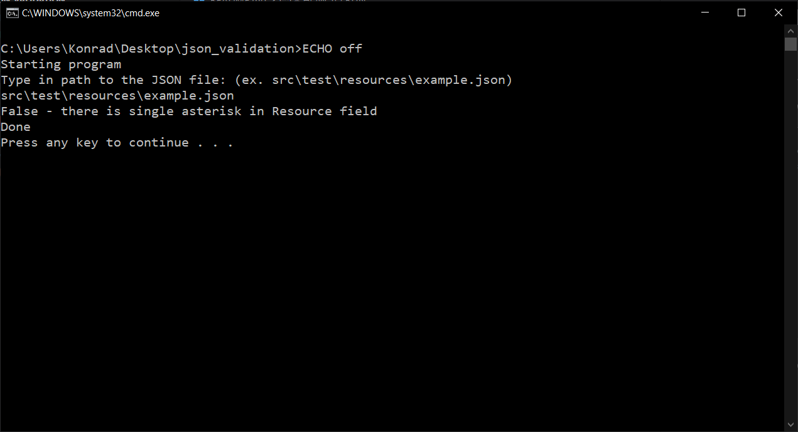

# HOW TO RUN

To run the program prepare your JSON file which You want to validate and path to that file, then doubleclick the `run.bat` file.

You should see this window:

Next You should input the path to the file and click enter:

You should see the result :)
